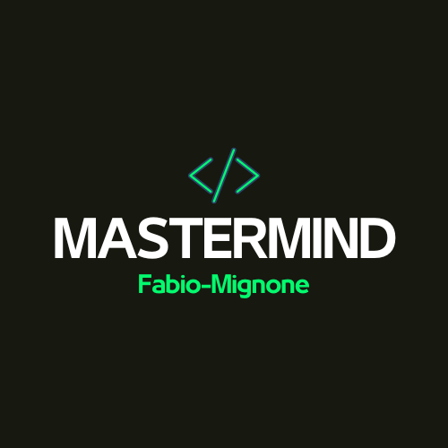
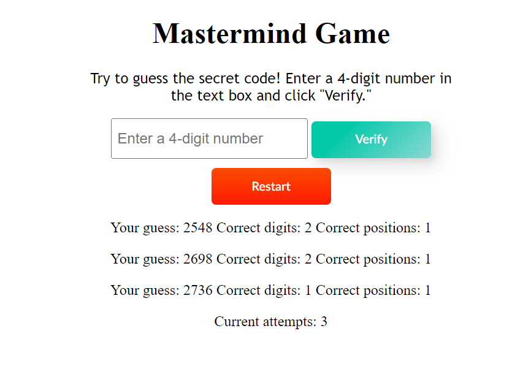

 

  

  <h3 align="center">MASTERMIND</h3>

  

    Mastermind game! Sharpen your logical thinking as you attempt to guess the secret code
     
     
    <a href="https://github.com/Fabio-Mignone/MASTERMIND"><strong>Explore the docs »</strong></a>
     
     
    <a href="https://github.com/Fabio-Mignone/MASTERMIND">View Demo</a>
    .
    <a href="https://github.com/Fabio-Mignone/MASTERMIND/issues">Report Bug</a>
    .
    <a href="https://github.com/Fabio-Mignone/MASTERMIND/issues">Request Feature</a>
  

    

## Table Of Contents

* [About the Project](#about-the-project)
* [Built With](#built-with)
* [Getting Started](#getting-started)
  * [Prerequisites](#prerequisites)
  * [Installation](#installation)
* [Usage](#usage)
* [Roadmap](#roadmap)
* [Contributing](#contributing)
* [License](#license)
* [Authors](#authors)

## About The Project

Introduction:
Mastermind: Unleash the power of your intellect in this captivating JavaScript adaptation of the timeless classic, the Mastermind game! Prepare to immerse yourself in a world of code-cracking excitement as you take on the challenge of deciphering a 4-digit secret code. With a maximum of 10 attempts at your disposal, every decision counts, making each move a thrilling blend of strategy and intuition.

How to Play:
The rules are simple - you're up against the computer's hidden 4-digit code, where each digit can range from 0 to 9. Your task is to guess the code within the given attempts. After each guess, the game will provide you with valuable feedback in the form of clues. Pay close attention to these hints: they will reveal how many digits you guessed correctly and how many of them are in the right position.

## Built With

This game is built using Javascript for the logic and html with the addition of Css for the front-end interface.

## Getting Started

The easiest way to run this game on your PC is by downloading the zip folder, unzip the repository with any tool and run the .html file(keep in mind the html file should be on the same folder of the other file to work).

### Prerequisites

To run the game you just need a browser(the css style maybe can be different due to browser interpretation).

### Installation

No installation required, unzip the file and run it(feel free to use it on your website, just respect the License)

## Usage

This app works perfectly on any browser, easy to implent on any other website

## Roadmap

See the [open issues](https://github.com/Fabio-Mignone/MASTERMIND/issues) for a list of proposed features (and known issues).

## Contributing

Contributions are what make the open source community such an amazing place to be learn, inspire, and create. Any contributions you make are **greatly appreciated**.
* If you have suggestions for adding or removing projects, feel free to [open an issue](https://github.com/Fabio-Mignone/MASTERMIND/issues/new) to discuss it, or directly create a pull request after you edit the *README.md* file with necessary changes.
* Please make sure you check your spelling and grammar.
* Create individual PR for each suggestion.
* Please also read through the [Code Of Conduct](https://github.com/Fabio-Mignone/MASTERMIND/blob/main/SECURITY.md) before posting your first idea as well.

### Creating A Pull Request

1. Fork the Project
2. Create your Feature Branch (`git checkout -b feature/AmazingFeature`)
3. Commit your Changes (`git commit -m 'Add some AmazingFeature'`)
4. Push to the Branch (`git push origin feature/AmazingFeature`)
5. Open a Pull Request

## License

Distributed under the GPL-3.0 License. See [LICENSE](https://github.com/Fabio-Mignone/MASTERMIND/blob/main/LICENSE) for more information.

## Authors

* **Mignone Fabio** - *Passionate Developer* - [Mignone Fabio](https://github.com/Fabio-Mignone)
